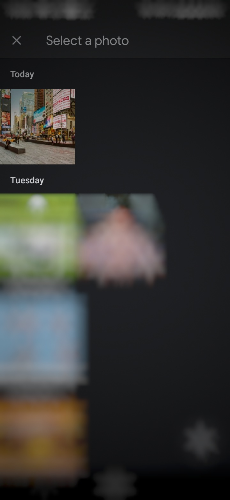

# Object-Detection-API( )

This project introduces an API for object detection. The server will do all the heavy work for the client even if client has low-end system. This API can be used by anyone for the object detection task freely. 
An image by the client will be sent to the API end-point in specific format and then API would do the object detection task and send back the object detected image. The received image will be obtained by the client with objects classified within that image. YOLO v3.0 is used as the object detection model.


## Setup Instructions

* Clone this repository `git clone https://github.com/loveleen-amar/Object-Detection-API.git`
* `cd Object-Detection-API`  will get you into root folder of the project.
* `cd API-Backend_Django` will get you into the Django Project Folder.
* Install all the python3 dependencies by `pip3 install -r requirements.txt`
* Download [yolov3.weights](https://pjreddie.com/media/files/yolov3.weights)
* Place *yolov3.weights* in `/API-Backend_Django/YOLOv3` directory.
  * The directory should look like
    ```
    API-Backend_Django/
    |-------image_process/
    |       |   ....
    |
    |-------WebAPI/
    |       |   ....
    |
    |-------YOLOv3/
    |       |   ....
    |       |   ....
    |       |---yolov3.weights
    |       |   ....
    
    ```    
* Now start the Django Server: `python3 manage.py runserver 0.0.0.0:80` . It will start the server at port 80 so that it can be accessed just by the IP address.
* There is very basic Interface too for confirming the working of the API. After starting the server, goto `http://localhost:PORT` which in this case is 80. Thus, access the server simply by `http://locahost`.

## Example
The basic web interface looks like:


After uploading photos, we get images with boundary boxes detected around it. For examples

<center>


<br>
<br>


</center>

## Working of the API

API accepts a Multipart POST Requests of the format:

```
POST / HTTP/1.1
Host: <IP_ADDRESS_OF_SERVER>/
Content-Type: multipart/form-data;
image=[bytearray of image]

```
The Image should be sent with `image` name. Postman or any mobile clients can be used comfortably with this API.
Image of any size can be used with this API. Though, Larger size images take longer to process.

<center></center>

## An APP-lication of Object Detection API
As a client of the above API, we built an Android App through which you can send a photo to the server and it will return a photo with bounding boxes and classification of objects in the image. You can download the app: [Download](https://drive.google.com/file/d/1Q60jO9s5ZHcFpWb5k7d6av53t2qZCaWR/view?usp=sharing)

Steps to use the App:
1.  Type the IP Address or Domain Name of the server

   <center></center>

2.  Select a photo and send

   <center></center>

3. You'll get an image in response with all the objects detected.

   <center></center>
   


## Built With
* [Django](https://www.djangoproject.com/) - Python Based Web Framework
* [PyTorch](https://pytorch.org/) - A Deep Learning Framework
* [YOLO v3.0](https://pjreddie.com/yolo/) - Object Detection Algorithm
* [Android Studio](https://developer.android.com/studio) - Android Development IDE
* [Retrofit](https://github.com/square/retrofit) - Android Java Library for easy HTTP requests management


## To-Do
* [X] Add Android Application
* [X] Update README for the Android App.
* [ ] Host the API on Heroku.
## Authors
* **Loveleen Amar** [LinkedIn](https://www.linkedin.com/in/loveleen-amar/) | [GitHub](https://github.com/loveleen-amar)
* **Sanchita Khare** [LinkedIn](https://www.linkedin.com/in/sanchita-khare/) | [GitHub](https://github.com/Sanchita99)
* **Rajiv Nayan Choubey** [LinkedIn](https://www.linkedin.com/in/rajivnayanc/) | [GitHub](https://github.com/rajivnayanc/)

## LICENSE
This project is licensed under the MIT License - see the [LICENSE](LICENSE) file for details.